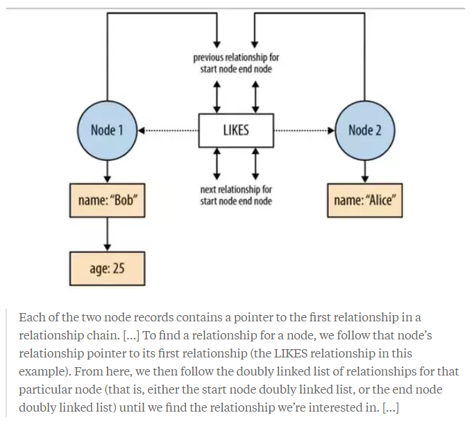
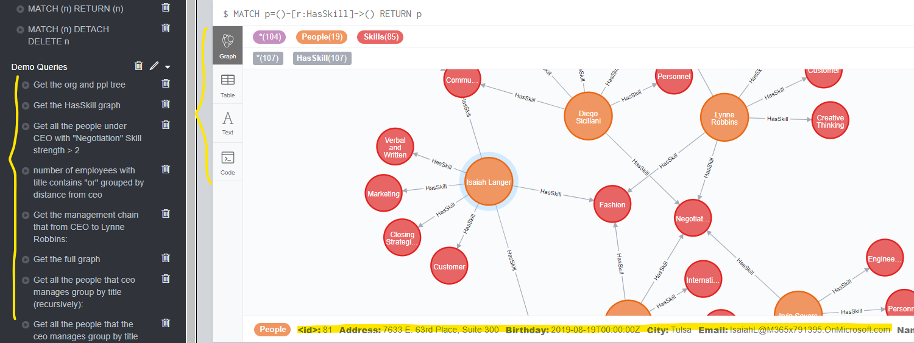
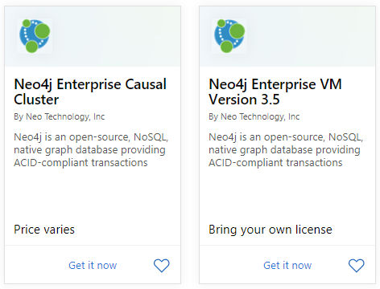
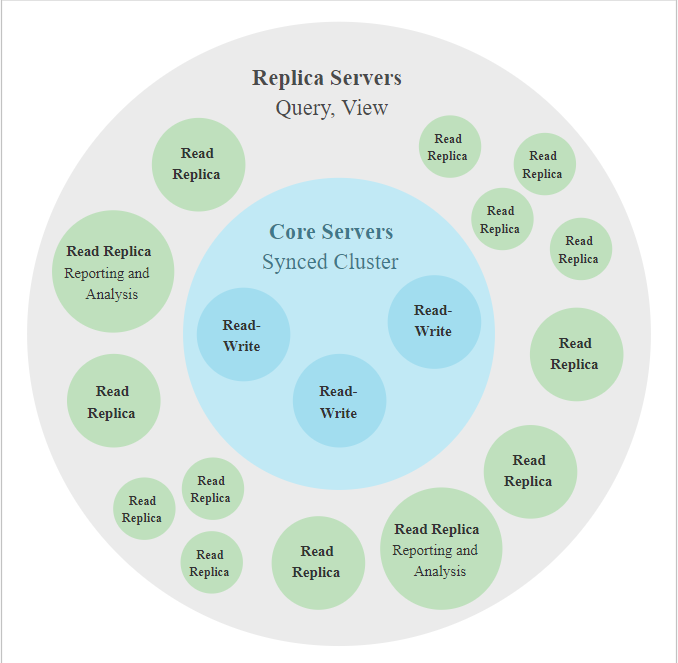
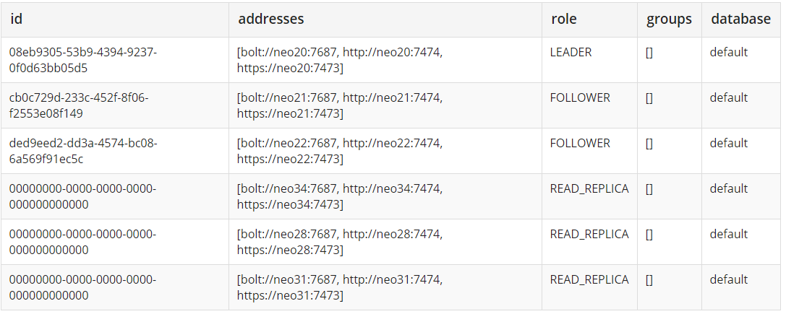
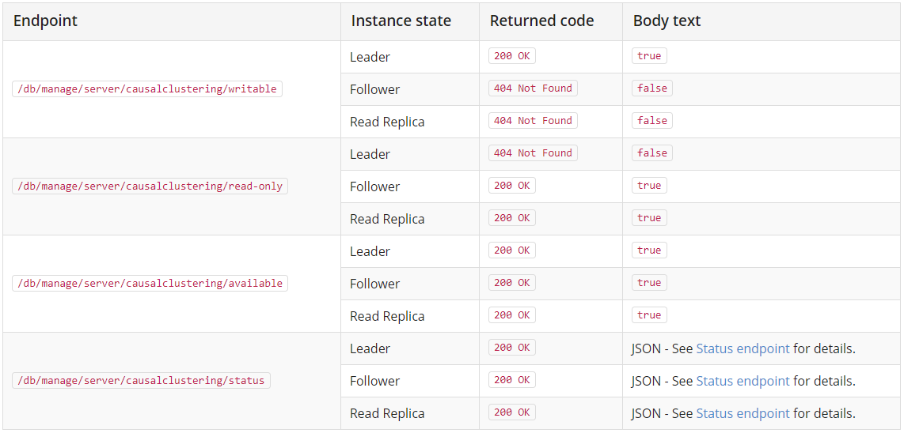
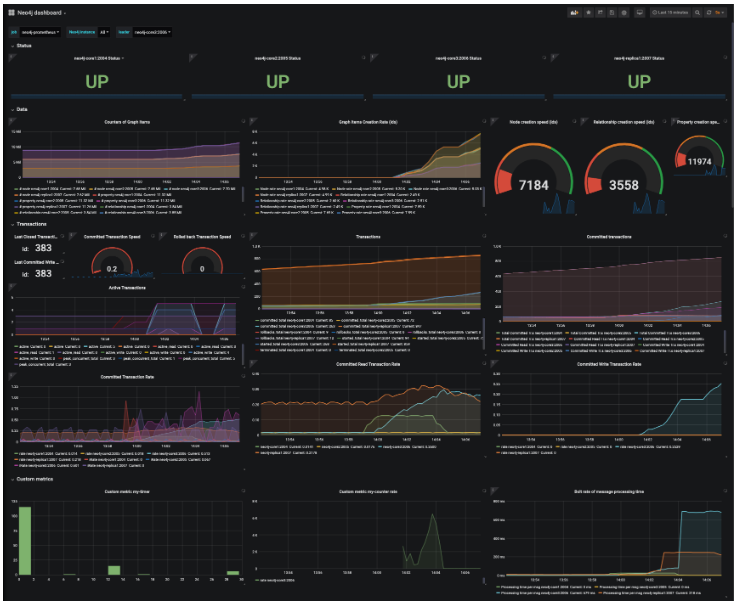
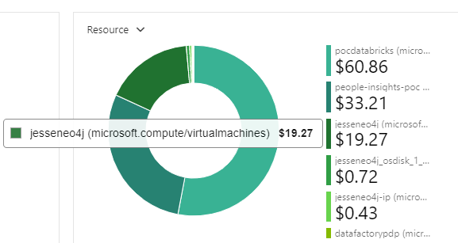

# Neo4j vs CosmosDB

## Table of Contents
- [Disk Storage](#Disk-Storage)
- [Query Language](#Query-Language)
- [Data Explorer](#Data-Explorer)
- [SDK / Library Support](#SDK-/-Library-Support)
- [Neo4j Cluster Operation in Production](#Neo4j-Cluster-Operation-in-Production)
- [Role Based Security (Enterprice Edition)](#Role-Based-Security-(Enterprice-Edition))
- [Other Advantages](#Other-Advantages)
- [Consulting Contact](#Consulting-Contact)


## Disk Storage
### Neo4j connect data as it stores it - All linked lists
- Properties are stored as a linked list, each holding a key and value and pointing to the next property. Each node or relationship references its first property record. 
- The Nodes also reference the first relationship in its relationship chain. 
- Each Relationship references its start and end node. It also references the previous and next relationship record for the start and end node respectively as doubly linked list.


### Cosmos DB - All JSON documents
```json
{
    "id": "5cc4d110-1081-4f53-ac37-75b9ed7c68c4",
    "label": "person",
    "type": "vertex",
    "properties": {
      "Email": [
        {
          "id": "900e65ff-f194-463c-bdd4-6fbe17f48fc2",
          "value": "ChristieC@M365x791395.OnMicrosoft.com"
        }
      ],
      "Address": [
        {
          "id": "ac75af63-a49b-4ec2-a588-6d75609df14d",
          "value": "9257 Towne Center Dr., Suite 400"
        }
      ],
      "Birthday": [
        {
          "id": "d9afa4b9-1382-4107-9ef6-cddf1c5290f9",
          "value": "2019-07-19T00:00:00Z"
        }
      ],
```

## Query Language 
### Usage (both are easy to read and learn)
- Cypher is SQL like - You declare what you want to see, and the engine figures out how to get that data for you. 
```
MATCH p = (e:Employee {EmployeeId: 858})-[:Manages*]->(EmployeeUnder) 
where EmployeeUnder.Title = "Software Engineer"
return count(p), order by length(p)
```

- Gremlin - You specify how to traverse the graph
```
g.V("18df261b")
    .repeat(out("manages"))
    .emit()
    .outE("employedAt")
    .groupCount()
    .by("Title") 
```
### Performance (unclear)

- [This stack overflow disucssion](https://stackoverflow.com/questions/13824962/neo4j-cypher-vs-gremlin-query-language)  has a lot contradict opinions, and opinions seem to changed from 2012 to now.
> "Cypher query may go wild into the graph in a wrong direction first. I have not done much with Gremlin, but I could imagine you get much more execution control with Gremlin."

> "Use cypher for query and gremlin for traversal. You will see the response timing yourself."

> "When all I want is to query data, I go with Cypher as it is more readable and easier to maintain. Gremlin is the fallback when a limitation is reached."

- [This article](https://dzone.com/articles/neo4j-client-now-supports) says Gremlin is efficient in simple query, but Cyper is efficient in complex traversals where back tracking is required.

## Data Explorer
- Custom node coloring, sizing
- Show properties values when hovered
- Frequent queries management
- Json view, download as CSV


## SDK / Library Support
### C# and .NET
#### Neo4j .NET Client
```java
User users = client.Cypher
    .Match("(p:Person)")
    .Return(p => p.As<User>())
    .Results.ToList();
```
- Support type casting
- Support fluent API
#### Neo4j .NET Driver
```java
List<User> users = new List<User>();
using (var session = _driver.Session())
{
    session.ReadTransaction(tx =>
    {
        var result = tx.Run("MATCH (p:Person) RETURN p");
        foreach(var record in result)
        {
            var nodeProps = JsonConvert.SerializeObject(record[0].As<INode>().Properties);
            users.Add(JsonConvert.DeserializeObject<User>(nodeProps));
        }
    });
}
```
- No support type casting, need to de-serialize on our own
- Query is a string in source code

#### Gremlin .NET Driver
```java
var graph = new Graph();
var g = graph.Traversal().WithRemote(new DriverRemoteConnection(new GremlinClient(_server)));

return g.V().hasLabel("person").has("age", gt(40)).ToList()
```
- Gremlin has fluent API, but CosmosDB does not support it yet, public preview Dec, 2019

```java
public async Task<PersonVertex> GetPersonByID(string id)
{
    var response = (await ExecuteReadQuery<dynamic>($"g.V('{id}').as('person').out('hasSkill').store('skills').in().has('id', '{id}').in('manages').as('manager').select('person', 'skills', 'manager').limit(1)"))[0];
    PersonVertex person = JsonConvert.DeserializeObject<PersonVertex>(response["person"]);
}
```
- No support type casting, need to de-serialize on our own
- Query is a string in source code
- We talk to Gremlin directly as additional layer to query CosmosDB as a graph, but if our CosmosDB run into issues, Gremlin layer might also abstract the error return by CosmosDB, which hinder trouble shooting.

### Spark
#### Write graph to Neo4j - Clean syntax
```scala
Neo4jDataFrame.mergeEdgeList(sc, peopleSkillsDF, ("People", Seq("PersonId")),("HasSkill", Seq("Strength")),("Skills", Seq("SkillId", "Skill")))
```

#### Write graph to CosmosDB - No Gremlin support
- Need to construct the required GraphSON schema on our own (not a big deal)
- Spark notebook doesn't know anything about Gremlin, it just write it as GraphSON schema
```scala
def toCosmosDBEdges(g: GraphFrame, labelColumn: String, partitionKey: String = "") : DataFrame = {
  var dfEdges = g.edges
  
  if (!partitionKey.isEmpty()) {
    dfEdges = dfEdges.alias("e")
      .join(g.vertices.alias("sv"), $"e.src" === $"sv.id")
      .join(g.vertices.alias("dv"), $"e.dst" === $"dv.id")
      .selectExpr("e.*", "sv." + partitionKey, "dv." + partitionKey + " AS _sinkPartition")
  }
  
  dfEdges = dfEdges
    .withColumn("id", udfUrlEncode(concat_ws("_", $"src", col(labelColumn), $"dst")))
    .withColumn("_isEdge", lit(true))
    .withColumn("_vertexId", udfUrlEncode($"src"))
    .withColumn("_sink", udfUrlEncode($"dst"))
    .withColumnRenamed(labelColumn, "label")
    .drop("src", "dst")
  
  dfEdges
}
```
#### Read graph from Neo4j in spark to perform analysis - Comprehensive support
- You can declare the queries or patterns you want to use, ``cypher(query,[params])``, ``nodes(query,[params])``, ``rels(query,[params])`` as direct query, or use pattern ``pattern(("Label1","prop1",("REL","prop"),("Label2","prop2))``

- Define load size
``partitions(n)``, ``batch(size)``, ``rows(count)`` for parallelism

- Choose to load graph as these datatypes:
``loadRowRdd``, ``loadNodeRdds``, ``loadRelRdd``, ``loadRdd[T]``
``loadDataFrame``, ``loadDataFrame(schema)``
``loadGraph[VD,ED]``
``loadGraphFrame[VD,ED]``

- Then perform analytical spark operations

#### Read graph from Cosmos DB in spark - No Gremlin support
- No Gremlin support for reading CosmosDB document as a graph

### Python, Kafka, GraphQL + React
- [Neo4j Python Driver + ``Py2Neo`` Python Client](https://neo4j.com/developer/python/)
- [Neo4j Streams Kafka Integration](https://neo4j.com/labs/kafka/)
- [GRANDstack and Neo4j GraphQL](https://neo4j.com/labs/grandstack-graphql/)


## Neo4j Cluster Operation in Production
We can create Neo4j cluster or single Neo4j instance on Azure, AWS or GCP



### Causal Clustering

- The out of the box clustering solution that provides fault tolerance, scalability, consistency (read-your-own-writes), and availability.



- Core servers has master-slave relationship, so if we lost the connection with the master node, they will auto raise a slave node to become the master, and when the previous master come back, it will become a slave.

- Write commitment: Once a majority of Core Servers in a cluster (N/2+1) have accepted the transaction, it is safe to acknowledge the commit to the end user application. This means that to tolerate two failed Core Servers we would need to have a cluster of five Cores.
So if you only have two cores, then it is not fault telerant, cuz once one core failed, we lost the ability to write.

- Read Replicas are asynchronously replicated from Core Servers via transaction logs. We usually have large numbers of Read Repicas and treat them as disposable. Losing a Read Replica does not impact the cluster’s availability or fault tolerance, it just lower the query throughput.

#### Logging
- Query Logging as a file ``query.log`` in VM.
- Security events logging (login, password change, role management) as a file ``security.log`` in VM.
```
2016-10-27 13:45:00.796+0000 INFO  [AsyncLog @ 2016-10-27 ...]  [johnsmith]: logged in
2016-10-27 13:47:53.443+0000 ERROR [AsyncLog @ 2016-10-27 ...]  [johndoe]: failed to log in: invalid principal or credentials
2016-10-27 13:48:28.566+0000 INFO  [AsyncLog @ 2016-10-27 ...]  [johnsmith]: created user `janedoe`
2016-10-27 13:48:32.753+0000 ERROR [AsyncLog @ 2016-10-27 ...]  [johnsmith]: tried to create user `janedoe`: The specified user ...
2016-10-27 13:49:11.880+0000 INFO  [AsyncLog @ 2016-10-27 ...]  [johnsmith]: added role `admin` to user `janedoe`
2016-10-27 13:49:34.979+0000 INFO  [AsyncLog @ 2016-10-27 ...]  [johnsmith]: deleted user `janedoe`
2016-10-27 13:49:37.053+0000 ERROR [AsyncLog @ 2016-10-27 ...]  [johnsmith]: tried to delete user `janedoe`: User 'janedoe' does ...
2016-10-27 14:00:02.050+0000 INFO  [AsyncLog @ 2016-10-27 ...]  [johnsmith]: created role `operator`
```

### Monitoring
#### Query Cluster Topology
``CALL dbms.cluster.overview()``

#### Health Check Endpoint

#### [Halin - Real Time Monitoring](https://www.youtube.com/watch?v=hKndQ2qF5ts&t=9m)
- Cluster Overview (stress testing, node down)
- Per Machine Monitoring
- Diagnostics Advisor
- Configuration Listing/Searching/Diff
- Roles Management
- Active Queries
- Metrics
- Log File Streaming
- **Halin won't do real time alert**

#### [Metrics and Alert: Officially suggest to use 3rd Party Solution](https://graphaware.com/neo4j/2019/06/11/monitoring-neo4j-prometheus.html)
```
# Setting for enabling all supported metrics.
metrics.enabled=true

# Setting for enabling all Neo4j-specific metrics.
metrics.neo4j.enabled=true

# Setting for exposing metrics about transactions; number of transactions started, committed, etc.
metrics.neo4j.tx.enabled=true

# Setting for exposing metrics about the Neo4j page cache; page faults, evictions, flushes and exceptions, etc.
metrics.neo4j.pagecache.enabled=true

# Setting for exposing metrics about approximately entities are in the database; nodes, relationships, properties, etc.
metrics.neo4j.counts.enabled=true

# Setting for exposing metrics about the network usage of the HA cluster component.
metrics.neo4j.network.enabled=true
```
- Prometheus: Publish metrics for polling as a set of Prometheus endpoints.
- So Prometheus endpoints ship those metrics data to 3rd Party service Grafana where the metrics are stored in a specialized timeseries database, and then you can set up alerts and so on.



#### Admin Actions
- View all running queries
- Terminate single/multiple queries
- View all network connections 
- Terminate single/multiple network connections
- View all active locks for a query
- Configure transaction timeout (Any query that updates the graph will run in a transaction)
- Configure lock waiting timeout

### Backup
In VM, do ``
bin/neo4j-admin backup --from=192.168.1.34 --backup-dir=/mnt/backup --name=graph.db-backup --pagecache=4G --fallback-to-full=true
``
- Online and offline backup: online backups run against a live Neo4j instance, while offline backups require that the database is shut down.
- Online backups can be full or incremental (specifiy directory of previous backup), offline can only do full backup.
- Recommended to select Read Replicas to act as backup providers, since we have a lot of them and they are cheap. So if large backup cause performance issues on a Read Replica, it will not affect the performance or redundancy of the Core Cluster.

### Price
- Microsoft already have a Neo4j License. 
- Below is the cost of my insgle Neo4j VM instance on Azure for a week. 


- I have created a Neo4j Causal Cluster on Azure (3 core nodes + 3 read replicas), there isn't any pricing info in Market Place or during the setup process, we can take a look of how much it cost after coupe days. 

- AWS Neo4j Causal Cluster cost 380/month, I would bet Azure is similar.

## Role Based Security (Enterprice Edition)
### Property-level Access Control 
> "You can use role-based, database-wide, property blacklists to limit which properties a user can read. (Deprecated)". New methods for this functionality will be provided in an upcoming release

```
dbms.security.property_level.enabled=true
dbms.security.property_level.blacklist=\
  roleX=propertyA;\
  roleY=propertyB,propertyC

CALL dbms.security.addRoleToUser('roleX', 'user-1')
```
The user-1 will be unable to read the property propertyA.

### SubGraph Access Control
> It is possible to restrict a user’s read or write to specified portions of the graph. For example, a user can be allowed to read, but not write, certain type of nodes or edges.
```
CALL dbms.security.createRole('accounting')
CALL dbms.security.addRoleToUser('accounting', 'billsmith')
```

## Other Advantages
- Community Support
- Official Documentation
- ACID Constrain (write safe)
- [Indexing](https://neo4j.com/docs/cypher-manual/current/schema/index/)
- [Neo4j Graph Algorithms Library](https://neo4j.com/developer/graph-algorithms/)
- [APOC](https://neo4j.com/developer/neo4j-apoc/)
> APOC is a standard library for common procedures and functions on Cypher. Before developers needed to write their own procedures and functions for common functionality causing a lot of duplication.
```
CALL apoc.date.format(timestamp(),"ms","dd.MM.yyyy")
// -> 07.07.2016
CALL apoc.date.parse("13.01.1975 19:00","s","dd.MM.yyyy HH:mm")
// -> 158871600
```
Dijkstra Graph Search
```
CALL apoc.help("dijkstra")

apoc.algo.dijkstra
 (startNode :: NODE?, endNode :: NODE?,
   relationshipTypesAndDirections :: STRING?, weightPropertyName :: STRING?)
:: (path :: PATH?, weight :: FLOAT?)
```
Load JSON
```
WITH 'https://raw.githubusercontent.com/neo4j-contrib/neo4j-apoc-procedures/{branch}/src/test/resources/person.json' AS url

CALL apoc.load.json(url) YIELD value as person

MERGE (p:Person {name:person.name})
   ON CREATE SET p.age = person.age, p.children = size(person.children)
```
- Docker Version instead of VM

## Consulting Contact 
- Shawn.Elliott@microsoft.com (Cloud architect appear in Neo4j-Azure video)
- Brian.Sherwin@microsoft.com did a comparison of Neo4j vs Cosmos DB Gremlin according to Hassaan.Ahmed@microsoft.com's article.